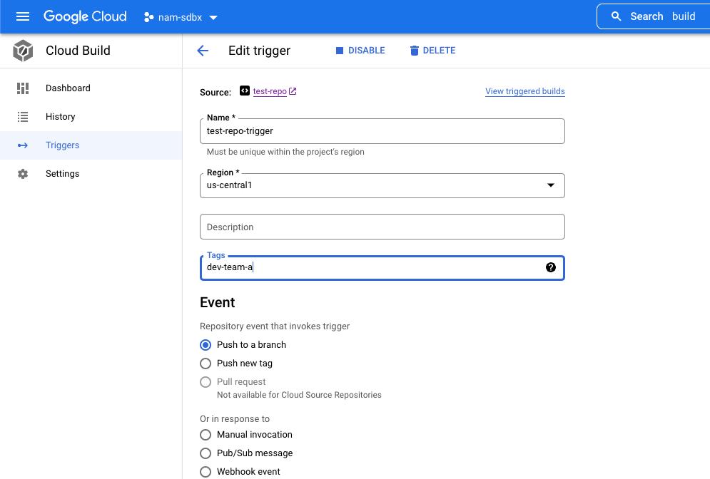

# Restrict Cloud Build Trigger Invocation
Currently in GCP, granting IAM access to a user to allow them to invoke a Cloud Build Trigger grants them access to invoke ALL Cloud Build Triggers in that project. In shared environments, this can result in development teams stepping on each other and accidentally invoking triggers that they do not own.
    
  
This repository serves as a stop gap to prevent development teams from invoking triggers that they do not own.
   
## Google Disclaimer
This is not an officially supported Google product
  
## Dependencies
- `gcloud cli >= 409.0.0`
- gcloud beta component installed
    - `gcloud components install beta`  
- `yq >= 4.27.2`
  
## Notice!
This solution does not actually remove a team's permissions / ability to invoke another team's triggers. Instead it provides a consistent trigger invocation interface that has logic baked in to prevent accidental invocation of someone else's triggers. If someone were to circumvent using this script / Makefile (i.e. invoke a Build Trigger via the UI or directly via the gcloud CLI), they would still have the ability to invoke any trigger.
  
  
## Usage
- Tag each of your Cloud Build Triggers with the respective Google Group name of whoever should be able to invoke the trigger (note that the tag must actually be an existing Google Group and the users that should have the ability to invoke that trigger should be members of that group
  -   
- Embed this [Makefile](./Makefile) and this [scripts](./scripts/) directory into the root of your repository
- Instruct developers to only invoke Cloud Build Triggers using the Makefile
- Switch to the git branch that this trigger should be run on and ensure all code changes are pushed upstream
    - i.e. git checkout `$YOUR_BRANCH_NAME`
    - git push
- From the root of your repository, run the following command while substituing our the `YOUR_TRIGGER_NAME` and `TRIGGER_REGION` vars for those values of your respective trigger:

```bash
make trigger trigger=${YOUR_TRIGGER_NAME} region=${TRIGGER_REGION}
```
- The Makefile + script will verify that the currently authenticated gcloud user is a member of at least one of the Google Groups `${YOUR_TRIGGER_NAME}` that is tagged with. If they are not, an error message will appear and the trigger will not be invoked. If they are, the trigger invocation will proceed for the current branch the user has checked out. 